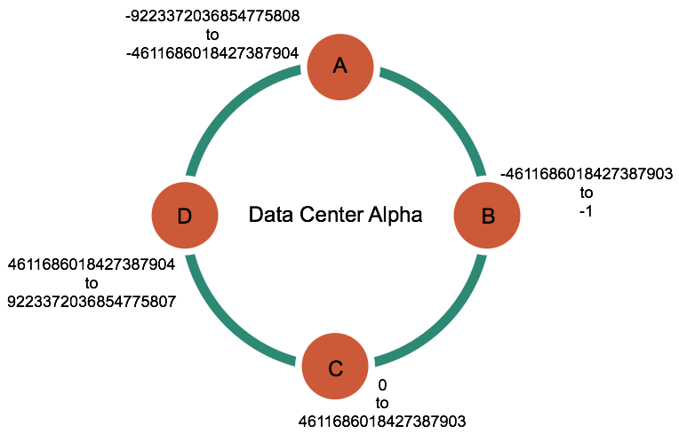
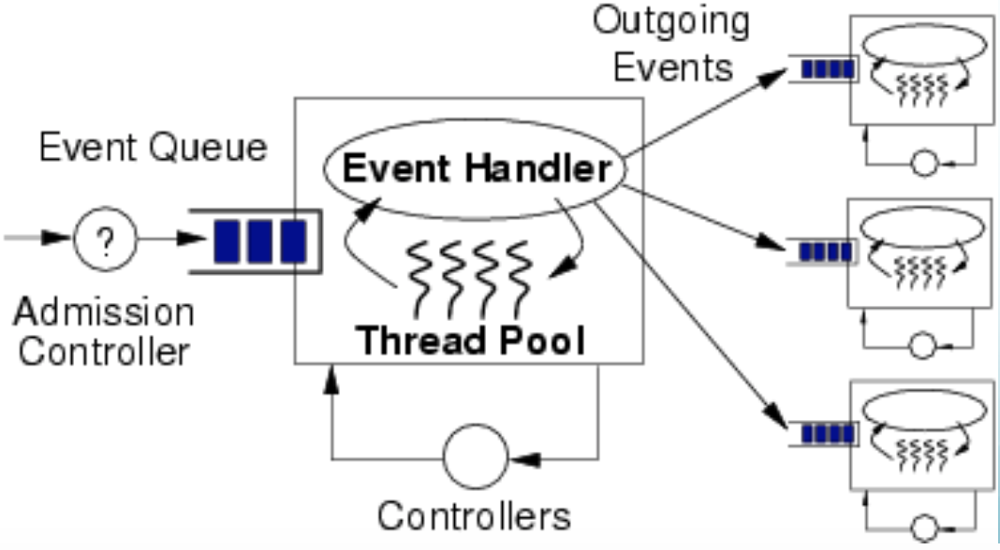

<!-- $theme: gaia -->

# NoSQL
### and

# 

### Bin Liu
##### 2017.7.7

---

> Select queries were slow until I added an index onto the timestamp field... Adding the index really helped our reporting, BUT now the inserts are taking forever.

‣ Comment on mysqlperformanceblog.com

---

> I'm trying to create indexes on a table with 308 million rows. It took ~20 minutes to load the table but 10 days to build indexes on it.

‣ MySQL bug #9544

---
<!-- page_number: true -->


# 特点

- 非固定 Schema
- Scalability（成本、性能）
- Performance
- 高可用
- 容错

---

# NoSQL 分类

- KV
- Column-oriented
- Document Database
- Graph Database

---

# NoSQL

- Redis
- BigTable
- Dynamo
- CouchDB
- Cassandra
- MongoDB
- Neo4j

---


# CAP

- Consistency：一致性
- Availability：可用性
- Partition-tolerance：分区容错

---


- CP
  - Bigtable/HBase
  - Redis
- AP
  - Dynamo/Cassandra
  - CouchDB
- <strike>&nbsp;CA&nbsp;</strike>，单机
  - MySQL
  - Postgre

---

# Hbase vs Cassandra

| |HBase|Cassandra|
|:-:|:-:|:-|
|CAP|cp|ap|
|数据分布式| sharding(Region) | 一致性哈希 |
|SPoF|Y|N|
|HOP|1-3|1|
|同一数据读写|单一节点|多节点|
|Consistency Level||OP（W/R）|
|节点故障|自动切换|手工恢复|

---


# Cassandra history

- 2007 Amazon 发布 Dynamo 论文，基于一致性哈希的最终一致性 key/value store
- 2008 Facebook 基于 Dynamo 创建
- 后开源并贡献给 ASF

---

# Cassandra 血统问题


--- 

- Amazon Dynamo
  - Consistent hashing
  - Partitioning
  - Replication
  - One-hop routing
- Google BigTable
  - Column Families
  - Memtables
  - SSTables

---

# 分布式存储系统

- 分区
- 副本
- 一致性

---

# HBase 分区


---

# Cassandra 分区


---

# 数据存储和分布模型


- Virtual nodes: 为数据分配物理节点
- Partitioner: 为数据分区
- Replication strategy: 行数据的副本策略
- Snitch: 为副本策略提供决策用的集群拓扑信息

---

# Consistent hashing



---

# Tokens

- 映射一组数据到某一节点
- row key -> partition key -> token
- 取值范围：0 - 2<sup>127</sup>-1

---

# HBase 数据寻址


---
# Virtual nodes（Vnodes）


---

- 分散请求
- 提高恢复速度


---

# Partitioners 

- 对数据进行分区（distribute）
- func: hash(row_key) -> token

---

# Cassandra partitioners

- Murmur3Partitioner（平均分布）
- RandomPartitioner（MD5 hash值，平均分布）
- ByteOrderedPartitioner
- 互不兼容，不能转换
- 数据平均分布=负载均衡

---

# Murmur3Partitioner 

- `MurmurHash` function
- 64-bit hash value of the partition key
- 取值范围 -2<sup>63</sup> to +2<sup>63</sup>-1.
- 快、性能高
- 比 RandomPartitioner 快 3-5 倍
- Auto loadblanace

---

# RandomPartitioner 

- MD5 hash value
- Cryptographic hash
- 0 to 2<sup>127</sup> -1
- Auto loadblanace

---

# ByteOrderedPartitioner 

- 按 key 的字节进行排序
- 支持 Range scan

- 但是不特别推荐：
  - 不容易做负载均衡
  - 读写热点

---

# Snitches 

节点的数据中心和 rack 属性

---

# Cassandra Replica


---


---

# Cassandra Data model


---

# Cassandra Data model

- keyspace（vs database ）
- column family（vs table）
- super column
- column
- key

---

# Keyspace

- key	String
- value	ColumnFamily[]

---

# ColumnFamily
- key	byte[]
- value	Column[]

---

# Column

- name(byte[])
- value(byte[])
- timestamp(long)

---

#  gossip

- P2P 网络通信协议
- 定期交换状态信息
- 信息带版本号


---

# SEED NODES

- 先驱节点
- 推荐一个数据中心使用 3 个 seed node

---

# Storage engine 

- Log-Structured Merge Tree
- 顺序 I/O
- 无锁 Read/Write

---

## Data structure

- Memtable
- SSTable
  - <small>Bloom Filter</small>
  - <small>Index</small>
  - <small>Data</small>
- Row Cache(LRU, CF data)
- Partition Key Cache(SSTable postion)
- Commit log(shared among tables)

---

# RDMBS

- B+Tree，for read， O(log N)
- Sharding ？
- Scale out

---

# SSTable

- 行、列都有序
- 行： row key、大小、列列表、列数量、bloom filter、列索引、行级别的墓碑信息

---


---

# Bloom Filter

- 特征检测
- 只能正确地回答:
  - 肯定不存在
  - 可能存在
- 偶尔会犯错
  - 伪阳性
  - 伪阴性
- 时间复杂度 O(k)

---

Bloom 算法

```
var:
  m,k: int
  hash_func: func(Object) -> n // 0 <= n < m
  f[k]: hash_func[]
  array_search[m], array_dict[m]:bit[]
  input: Object

# write
for i := range(k):
  array_dict[f[i](input)] = 1

# read
for i := range(k):
  array_search[f[i](input)] = 1
if array_dict & array_search = array_search:
  // may be exists
else:
  // not exists
```

---
<small><small>Bloom 算法例</small></small>

```
m=10, k=3; f1=体重%10; f2=身高%10; f3=年龄%10
A: (82,171,25) -> 2,1,5
B: (85,173,29) -> 5,3,9
C: (87,171,25) -> 7,1,5
D: (82,175,31) -> 2,5,1
```

|Bit |0|1|2|3|4|5|6|7|8|9|
|:-:|:-:|:-|:-|:-|:-|:-|:-|:-|:-|:-|
|A|0|<font color=red>1</font>|<font color=red>1</font>|0|0|<font color=red>1</font>|0|0|0|0|
|B|0|0|0|<font color=red>1</font>|0|<font color=red>1</font>|0|0|0|<font color=red>1</font>|
|Dict|0|<font color=red>1</font>|<font color=red>1</font>|<font color=red>1</font>|0|<font color=red>1</font>|0|0|0|<font color=red>1</font>|
|C|0|<font color=orange>1</font>|0|0|0|<font color=orange>1</font>|0|<strike><font color=orange>1</font></strike>|0|0|
|D|0|<font color=orange>1</font>|<font color=orange>1</font>|0|0|<font color=orange>1</font>|0|0|0|0|

---

# 尽管磁盘很便宜
# 还是需要压缩

---

# Dictionary Encoding


<small><small>From: http://engineer.retty.me/entry/columnar-storage-format</small></small> 


---
# Run-Length Encoding（RLE）


<small><small>From: http://engineer.retty.me/entry/columnar-storage-format</small></small> 

---

# Delta Encoding


<small><small>From: http://engineer.retty.me/entry/columnar-storage-format</small></small> 

---

# Double-delta-encoding


- 0: 0
- [-63, 64]: 10 + D (7bits)
- [-255, 256]: 110 + D (9bits)
- [-2047, 2048]: 1110 + D (12bits)
- Other: 1111 + D(32bits)

---

# XOR encoding

```
x = value1 `XOR` value2
if x == 0:
  write 0
else:
  write 1
  if this_meaningful_bits == prev_meaningful_bits:
    write 0
      write this_meaningful_bits
  else:
    write 1
    write length(prefix_zero) # 5 bits
    write length(this_meaningful_bits) # 6 bits
    write this_meaningful_bits

```
---

# Gorilla timestamp and value


---

## String

要素：
- 压缩率
- CPU
- 速度

选择：
- gzip
- lzo
- **snappy**

---

# Write data


---

# Compaction 

- 将多个小的 SSTable 合并为一个大的 SSTable
- 多版本采用最新值
- 数据已排序顺序 I/O
- 删除数据

---

# Reading Data


---

# Consistency

-  Eventual consistency
-  Tunable(operation-level) consistency
-  CP or AP

---

# Strong consistency

- <strong>R + W > N</strong>
- R: 读的一致性级别
- W: 写的一致性级别
- N: 副本数
- `ONE/ANY/QUORUM/ALL/... ...`
---

# Consistency

- 强一致性
(R + W > N)
- 最终一致
(R + W <= N)
- W=ONE,R=ALL;W=ALL,R=ONE

---

# 数据不一致或者节点宕机 ?

- read repair
- hinted handoffs

---

#### SEDA(Staged Event-Driven Architecture)

- Thread + Event (Event Queue+Thread Pool)
- Thread pool by stage
- Event Driven between stage by message passing



---

# Questions ?
